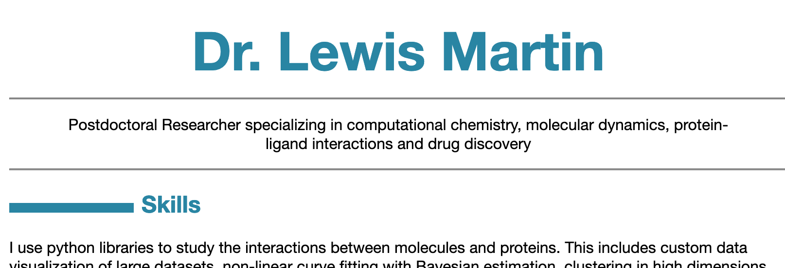

# cv
my cv in markdown / pandoc

see https://blog.chmd.fr/editing-a-cv-in-markdown-with-pandoc.html

# example:



to build:
```
pandoc --standalone --from markdown --to html -o index.html index.md
```
